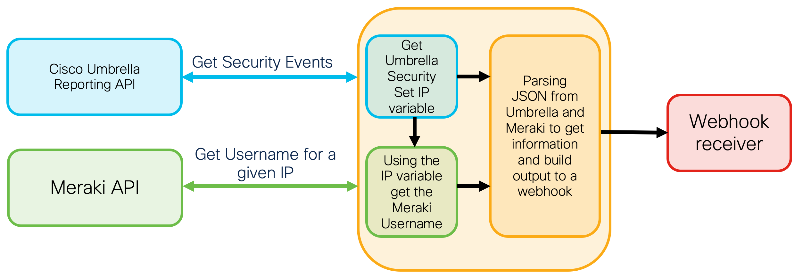
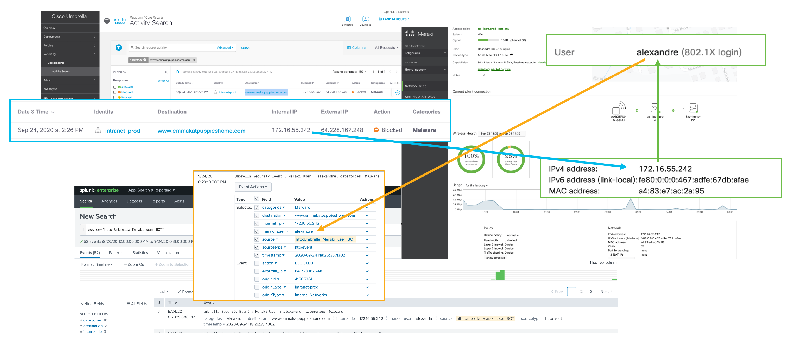

### How to correlate Umbrella Security Events with Meraki User
  
This repo contains a Python script that simplifies the correlation of all the Umbrella Security Events with Meraki users using API and sending the result to Splunk.

 

  
Please contact me at alexandre@argeris.net, if you have any questions or remarks. If you find any bugs, please report them to me, and I will correct them. 
  
### VARIABLES TO MODIFY BEFORE RUNNING THE SCRIPT

##UPDATE please import meraki==0.34
##FIX fonction getshardurl

### EXAMPLE

